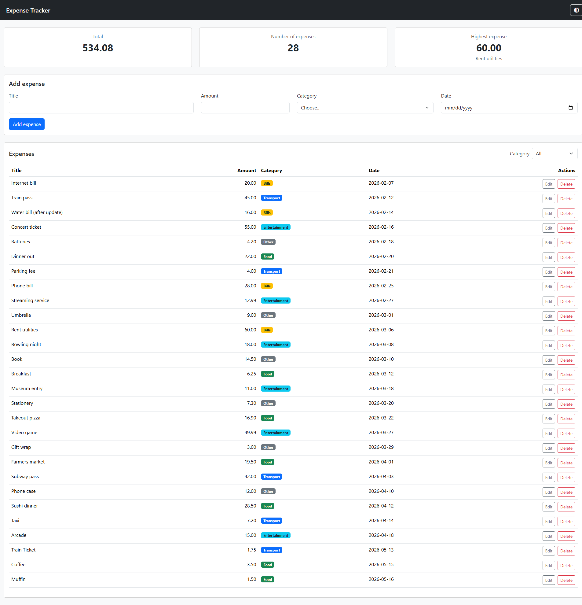

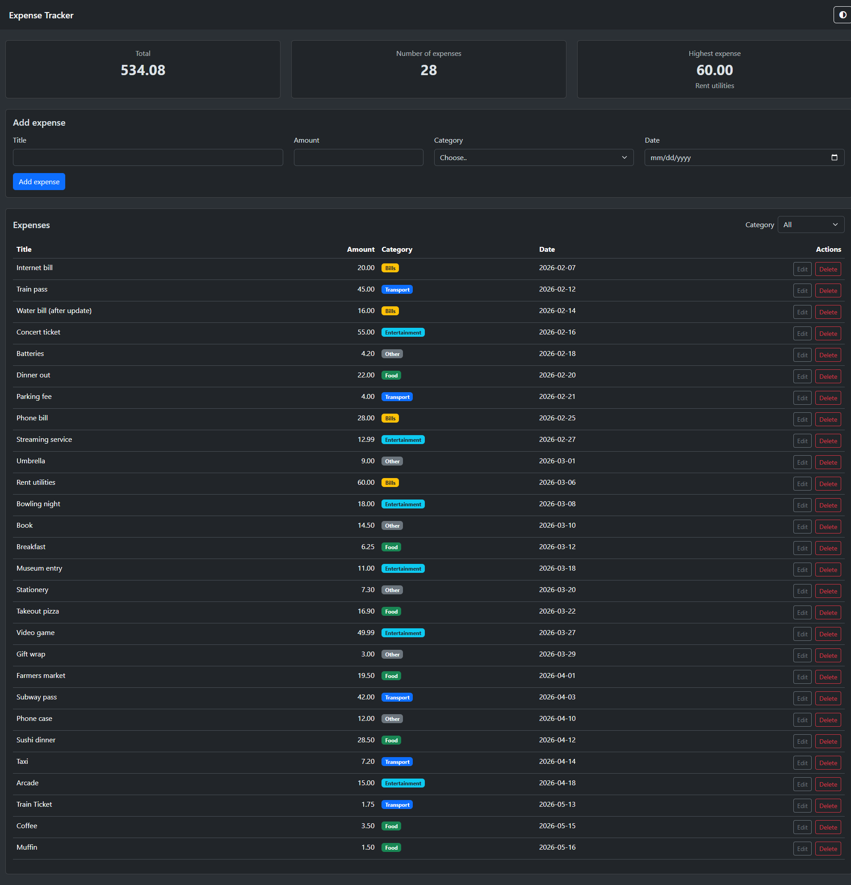

# Expense Tracker

A web app to track personal expenses. You can add, edit, delete and filter expenses by category,
and see the total, the number of expenses and the highest one right away
The data is saved in PostgreSQL through a Node.js and Express API,
and the front-end (HTML, Bootstrap and JavaScript) talks to it with fetch.

## How to run

You need VS Code with the Live Server extention

**Backend**

1. Open pgAdmin and create and empty database table named expense_tracker.

2. Right-click the new database, open the Query Tool, open the file backend/schema.sql, and run it. This creates the expenses table and adds some sample data. (Running it again deletes the table and starts again from the sample data.)

3. In the backend folder, copy .env.example to a new file named .env and write your PostgreSQL values in it:
   DB_HOST=localhost
   DB_PORT=5432
   DB_USER=postgres
   DB_PASSWORD=your_password_here
   DB_NAME=expense_tracker

4. Open a terminal in the backend folder and install the packages:
   npm install

5. Start the servre:
   npm start

You should see Server running at http://localhost:3000. Keep this terminal open while you use the app.

**Frontend**

1. In VS Code, open the frontend folder.

2. Right-click index.html and choose Open with Live Server.

3. The page opens in the browser and shows the expenses from the database. (The server from the backend steps must be running.)

## API
| Method | Path | What it does | Success | Errors |
|---|---|---|---|---|
| GET | `/api/expenses` | Returns all expenses | 200 | - |
| GET | `/api/expenses/:id` | Returns one expense | 200 | 404 |
| POST | `/api/expenses` | Adds a new expense | 201 | 400 |
| PUT | `/api/expenses/:id` | Updates an expense | 200 | 400, 404 |
| DELETE | `/api/expenses/:id` | Deletes an expense | 200 | 404 |

## Features

 Add an expense (with validation)
 Delete an expense
 Edit an expense (in a modal)
 Filter by category
 Summary cards (total, count, highest)
 Data is saved in a PostgreSQL database
 Loading spinner and error alerts (including a clear message when the server is off)
 Responsive design, with CSS Grid for the summary cards
 Bonus: dark mode toggle button (the choice is remembered after reload) and export the expenses as a CSV file button

## Screenshots

<!-- Add 2-3 screenshots of your app (desktop and mobile). -->

## What was the hardest part?

<!-- A short paragraph: what got you stuck, and how did you solve it? -->

I don't know if i should call it the hardest part, but it's the self learning part about the backend, since I've never worked with these topics before.. Learning new stuff and immedietly trying to put them into use working in a real project was a first to me. But I kept searching and looking on how to apply them until I figured it out.

## The Demo

[Watch the demo video](https://drive.google.com/file/d/1RVincSdUELX5Q_lfQduIWQUvuFMvXex2/view?usp=sharing)